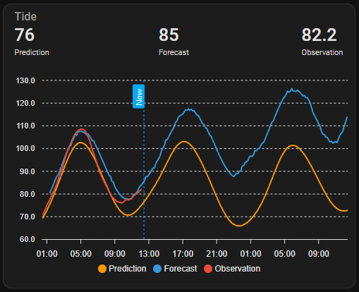

# Norwegian Tide Lite- lovelace examples

Just some examples to help you set up lovelace cards with the integration.

The integration is now modelled on the weather platform with a service call to
obtain the tide forecast data. The tide sensor returns the tide heights and times but not the
actual prediction which must be retrieved through the provided service.

To obtain the tide forecast from the tide entity you should implement something similar to this
trigger based template in your ```configuration.yaml``` (replace ```sensor.home_tide_main``` with your own tide sensor.)

```yaml
template:
  - trigger:
      - platform: time_pattern
        minutes: /10
    action:
      - service: norwegiantidelite.get_tides
        target:
          entity_id: sensor.home_tide_main
        response_variable: tide_table
    sensor:
      - name: home_tide_response
        unique_id: tide_home
        state: "{{ tide_table['states']['observation'] }}"
        attributes:
          data: "{{ tide_table['data'] }}"  
```

It's also a good idea to set up the ```recorder``` to exclude this sensor as it is 
usually larger than can be stored. To do that add similar to the following in your configuration:

```yaml
recorder:
    exclude:
        entities:
          - sensor.home_tide_response
```
By using the [Apexchart-card](https://github.com/RomRider/apexcharts-card) by Romrider - an excellent graph card for lovelace which also enables the possibility to show future values. 

[yaml](lovelace-apexchart.yaml):




Some more examples [yaml](lovelace-all.yaml):
(to be updated)


